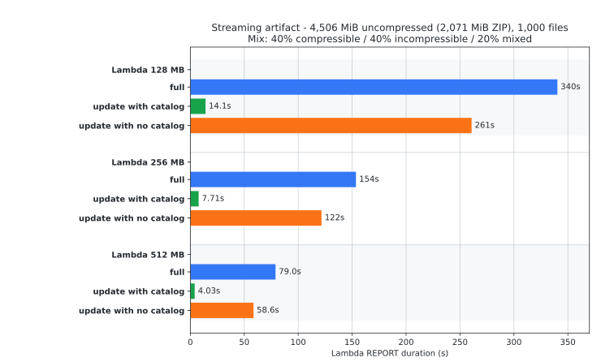

# s3-unspool

[](https://openai.com/codex)
[](https://crates.io/crates/s3-unspool)

<picture>
  <source media="(prefers-color-scheme: dark)" srcset="docs/assets/s3-unspool-hero-v2.png">
  <source media="(prefers-color-scheme: light)" srcset="docs/assets/s3-unspool-hero-v2-light.png">
  
</picture>

`s3-unspool` is a Rust crate for fast, bounded-memory ZIP extraction from S3
into S3.

It is built for deployment-style archives, Lambda jobs, and other low-scratch
environments where downloading a ZIP to local disk is either slow or impossible.
The extractor reads the source archive with ranged S3 `GetObject` requests,
lists the destination prefix once, skips unchanged files when a catalog is
available, and writes missing or changed files with conditional `PutObject`
requests.

The crate also includes zip helpers that stream either a local directory or an
existing S3 prefix into a cataloged local or S3 ZIP. ZIPs produced by those
helpers can be extracted later without decompressing unchanged entries.

## At a Glance

| Capability | What happens |
| --- | --- |
| Full unzip | Stream a ZIP from local disk or S3 into a local directory or S3 prefix. |
| Incremental extract | Skip unchanged files before decompression when the ZIP contains the embedded catalog. |
| Safe overwrite | Use `If-None-Match` for new keys and `If-Match` for changed keys. |
| Destination scan | Use one `ListObjectsV2` pass; no per-object destination `HeadObject` calls. |
| Zip helpers | Stream a local directory or existing S3 prefix into a cataloged local or S3 ZIP. |
| Directory markers | Preserve ZIP directory entries and zero-byte S3 folder marker objects for round trips. |
| Large archive support | Plan source byte ranges and keep only a bounded source block window in memory. |

Use `s3-unspool` when you need to deploy or synchronize many files from a ZIP
archive already stored in S3, especially when repeated runs should touch only
changed files.

It is not a general archive library. ZIP extraction currently supports Stored
and Deflate entries, destination writes are single `PutObject` requests, and
destination ETags are expected to be single-part MD5 ETags.

## Lambda Benchmark Snapshot

The latest benchmark uses a 1,000-file fixture with a 40% compressible, 40%
incompressible, and 20% mixed-content split. The archive is 4,506 MiB when
extracted and 2,071 MiB as a ZIP, so every memory size below extracts a source
archive much larger than available Lambda memory.

Timings are Lambda CloudWatch `REPORT` duration medians from three samples per
configuration. Cold-start init time and local AWS CLI round-trip time are not
included.

<picture>
  <source media="(prefers-color-scheme: dark)" srcset="docs/assets/benchmarks/streaming-20260430T011727Z/duration-streaming-dark.svg">
  <source media="(prefers-color-scheme: light)" srcset="docs/assets/benchmarks/streaming-20260430T011727Z/duration-streaming-light.svg">
  
</picture>

| Lambda memory | Full extract | 5% update with catalog | 5% update without catalog | Median max memory |
| ---: | ---: | ---: | ---: | ---: |
| 128 MB | 340.31s | 14.09s | 260.73s | 92-103 MB |
| 256 MB | 153.54s | 7.71s | 121.60s | 115-202 MB |
| 512 MB | 78.99s | 4.03s | 58.57s | 200-511 MB |

All 27 measured invokes completed with zero reported extraction errors, zero S3
throttles, and zero source `GetObject` errors. Four destination `PutObject`
dispatch failures occurred in the 256 MB full-extract samples and were retried
successfully.

## Contents

- [Install](#install)
- [Quick Start](#quick-start)
- [Extraction Model](#extraction-model)
- [Required S3 Permissions](#required-s3-permissions)
- [Fast Updates](#fast-updates)
- [Command-Line Testing](#command-line-testing)
- [Performance and Architecture](#performance-and-architecture)
- [Benchmarking With Lambda](#benchmarking-with-lambda)
- [Fixture Tools](#fixture-tools)
- [Assumptions and Limits](#assumptions-and-limits)

## Install

```sh
cargo add s3-unspool
```

The published crate contains the library API. The CLI and Lambda code in this
repository are packaged separately: the CLI is available as the pre-release
`s3-unspool-cli` crate, and the Lambda package remains a development and
benchmark tool.

Install the CLI with `cargo-binstall` when prebuilt GitHub Release artifacts are
available:

```sh
cargo binstall s3-unspool-cli --version 0.1.0-beta.3
```

The CLI crate name is `s3-unspool-cli`, but the installed command is
`s3-unspool`.

## Quick Start

Create an AWS S3 client with the normal AWS SDK configuration. The two core
library operations are unzipping an existing ZIP into an S3 prefix and zipping a
local directory or S3 prefix as a cataloged ZIP for fast future extracts.

### Extract an S3 ZIP to a Destination Prefix

Use `sync_zip_to_s3` when the ZIP already exists in S3. The archive is read with
ranged `GetObject` requests, destination objects are listed once, and missing or
changed entries are streamed directly into the destination prefix.

```rust
use aws_config::BehaviorVersion;
use aws_sdk_s3::Client;
use s3_unspool::{S3Object, S3Prefix, SyncOptions, sync_zip_to_s3};

#[tokio::main]
async fn main() -> s3_unspool::Result<()> {
    let config = aws_config::load_defaults(BehaviorVersion::latest()).await;
    let client = Client::new(&config);

    let mut extract = SyncOptions::new(
        S3Object::parse("s3://my-bucket/releases/site.zip")?,
        S3Prefix::parse("s3://my-bucket/www/")?,
    );
    extract.delete_extra = true;
    extract.collect_diagnostics = true;

    let report = sync_zip_to_s3(&client, extract).await?;
    println!("changed files: {}", report.summary.uploaded_changed);

    Ok(())
}
```

`SyncOptions::ignore_embedded_catalog` is `false` by default. Set it to `true`
to benchmark or force the fallback extract-and-hash comparison path against the
same ZIP object.

### Extract Selected ZIP Entries

Set `SyncOptions::selection` when only a subset of entries should be restored
from an S3 ZIP. Selection patterns use gitignore-style syntax and are applied
before source range planning, so the existing block coalescing still reduces
ranged `GetObject` calls for the selected entries. Exclude-only selections
restore every non-excluded ZIP entry.

```rust
use aws_config::BehaviorVersion;
use aws_sdk_s3::Client;
use s3_unspool::{S3Object, S3Prefix, SyncOptions, UnzipSelection, sync_zip_to_s3};

#[tokio::main]
async fn main() -> s3_unspool::Result<()> {
    let config = aws_config::load_defaults(BehaviorVersion::latest()).await;
    let client = Client::new(&config);

    let extract = SyncOptions::new(
        S3Object::parse("s3://my-bucket/releases/site.zip")?,
        S3Prefix::parse("s3://my-bucket/www/")?,
    )
    .with_selection(
        UnzipSelection::new()
            .include("index.md")
            .include("docs/**/*.md")
            .exclude("docs/drafts/**"),
    );

    let report = sync_zip_to_s3(&client, extract).await?;
    println!("processed entries: {}", report.summary.zip_files);

    Ok(())
}
```

Selected extracts cannot be combined with `delete_extra`, because unselected
destination objects are outside the restore scope.

### Upload a Directory as a Cataloged ZIP

Use `upload_directory_zip_to_s3` when you want `s3-unspool` to create the source
ZIP. Uploads stream the ZIP into S3 with multipart upload and include the
embedded catalog by default. Empty local directories are written as ZIP
directory entries so a later extract can recreate them as S3 marker objects.

```rust
use aws_config::BehaviorVersion;
use aws_sdk_s3::Client;
use s3_unspool::{S3Object, UploadOptions, upload_directory_zip_to_s3};

#[tokio::main]
async fn main() -> s3_unspool::Result<()> {
    let config = aws_config::load_defaults(BehaviorVersion::latest()).await;
    let client = Client::new(&config);

    let upload = UploadOptions::new(
        "./site",
        S3Object::parse("s3://my-bucket/releases/site.zip")?,
    );
    let report = upload_directory_zip_to_s3(&client, upload).await?;

    println!(
        "uploaded {} files into {} bytes",
        report.files, report.zip_bytes
    );

    Ok(())
}
```

`UploadOptions::include_catalog` is `true` by default. Set it to `false` only
when you need a plain ZIP without the update-skip catalog.

### Upload an S3 Prefix as a Cataloged ZIP

Use `zip_s3_prefix_to_s3` when the source files already live in S3 and you want
to snapshot them into a ZIP object without downloading them locally. Source
objects are streamed with `GetObject`, and the destination ZIP is written with
multipart upload.

```rust
use aws_config::BehaviorVersion;
use aws_sdk_s3::Client;
use s3_unspool::{S3Object, S3Prefix, S3PrefixUploadOptions, zip_s3_prefix_to_s3};

#[tokio::main]
async fn main() -> s3_unspool::Result<()> {
    let config = aws_config::load_defaults(BehaviorVersion::latest()).await;
    let client = Client::new(&config);

    let upload = S3PrefixUploadOptions::new(
        S3Prefix::parse("s3://my-bucket/www/")?,
        S3Object::parse("s3://my-bucket/releases/site.zip")?,
    );
    let report = zip_s3_prefix_to_s3(&client, upload).await?;

    println!(
        "uploaded {} files and {} directories into {} bytes",
        report.files, report.directories, report.zip_bytes
    );

    Ok(())
}
```

The destination ZIP object cannot be inside the listed source prefix. That
prevents an existing archive from being accidentally included in the new
archive.

### Source and Destination Clients

For simple jobs, `sync_zip_to_s3` uses one S3 client for source reads and
destination writes.

For high-concurrency extraction, prefer separate clients with AWS SDK upload
stalled-stream protection disabled on the destination client. A destination
request body can legitimately pause while it waits for planned source ranges.
Keep download stalled-stream protection enabled for source reads.

```rust
use aws_config::BehaviorVersion;
use aws_sdk_s3::config::StalledStreamProtectionConfig;
use aws_sdk_s3::Client;
use s3_unspool::{S3Object, S3Prefix, SyncOptions, sync_zip_to_s3_with_clients};

#[tokio::main]
async fn main() -> s3_unspool::Result<()> {
    let config = aws_config::load_defaults(BehaviorVersion::latest()).await;
    let source_client = Client::new(&config);
    let destination_client = Client::from_conf(
        aws_sdk_s3::config::Builder::from(&config)
            .stalled_stream_protection(
                StalledStreamProtectionConfig::enabled()
                    .upload_enabled(false)
                    .download_enabled(true)
                    .build(),
            )
            .build(),
    );

    let extract = SyncOptions::new(
        S3Object::parse("s3://my-bucket/releases/site.zip")?,
        S3Prefix::parse("s3://my-bucket/www/")?,
    );

    sync_zip_to_s3_with_clients(&source_client, &destination_client, extract).await?;
    Ok(())
}
```

## Extraction Model

The extract flow is:

1. Read the ZIP central directory, and embedded catalog metadata unless it is
   ignored, from S3 with ranged `GetObject` requests.
2. List the destination prefix once with `ListObjectsV2`.
3. Compare ZIP entries with destination keys and listed ETags.
4. Skip unchanged entries directly when catalog MD5s are available; otherwise
   stream existing entries through the ZIP decoder to hash them.
5. Upload missing or changed destination objects with conditional `PutObject`.
6. Optionally delete destination objects that are not present in the ZIP.

Destination checks do not use per-file `HeadObject` calls. The destination ETag
from `ListObjectsV2` is the comparison point.

Conditional writes protect against overwriting newer destination data:

- Missing keys are uploaded with `If-None-Match: *`.
- Changed keys are uploaded with `If-Match: <listed destination ETag>`.
- If the condition fails, the object is reported as a conflict and extraction
  continues.

Library callers that prefer all-or-nothing behavior can set
`SyncOptions::fail_on_conditional_conflict = true`. In that mode, the first
observed conditional conflict returns an error and the run stops before
deleting extra destination objects.

### Directory Marker Policy

ZIP directory entries and S3 folder marker objects are preserved explicitly:

- A ZIP directory entry such as `assets/empty/` extracts to a zero-byte S3
  object with the same trailing-slash key.
- An empty local directory uploads as a ZIP directory entry.
- A zero-byte S3 object whose key ends in `/` uploads as a ZIP directory entry.
- A zero-byte S3 object whose key does not end in `/` uploads as a regular file
  entry.
- A nonzero S3 object whose key ends in `/` is rejected as ambiguous.

This policy makes empty directories round-trip through ZIP -> S3 -> ZIP instead
of disappearing silently.

## Required S3 Permissions

Extraction needs:

| Scope | Permission | Why |
| --- | --- | --- |
| Source ZIP object | `s3:GetObject` | Read ZIP metadata and ranged source bytes. |
| Destination bucket | `s3:ListBucket` | List destination keys and ETags once. |
| Destination prefix | `s3:PutObject` | Write missing and changed objects. |
| Destination prefix | `s3:GetObject` | Authorize conditional overwrites with `If-Match`. |
| Destination prefix | `s3:DeleteObject` | Only needed when `delete_extra` is enabled. |

S3-prefix upload needs:

| Scope | Permission | Why |
| --- | --- | --- |
| Source bucket | `s3:ListBucket` | List source keys, sizes, and ETags. |
| Source prefix | `s3:GetObject` | Stream each source object into the ZIP. |
| Destination ZIP object | `s3:PutObject`, `s3:AbortMultipartUpload` | Write the generated ZIP with multipart upload and clean up failed uploads. |

The destination `s3:GetObject` permission is required even though
`s3-unspool` does not issue per-file destination `HeadObject` requests or read
destination object bodies. S3 authorizes `PutObject` requests with
`If-Match: <etag>` against object-read permission; without destination
`s3:GetObject`, changed files are rejected with `AccessDenied`.

## Fast Updates

ZIPs created by `s3-unspool` include an embedded catalog at:

```text
.s3-unspool/catalog.v1.json
```

The catalog records each file path and MD5 digest. During extraction,
`s3-unspool` can compare those digests directly with destination ETags and skip
unchanged entries before decompressing them.

External ZIP files are still supported. If the embedded catalog is missing,
`s3-unspool` falls back to streaming entries and hashing them while extracting.
Use `SyncOptions::ignore_embedded_catalog = true`, CLI `--ignore-catalog`, or
Lambda payload `"ignoreCatalog": true` to force that fallback path.

`zip --no-catalog` controls catalog creation when building a new ZIP.
`unzip --ignore-catalog` controls whether extraction uses an embedded catalog
that is already present in the source ZIP.

The embedded catalog file is reserved. It is never extracted to the destination,
and upload sources cannot contain a file at that path.

## Command-Line Testing

The CLI runs the same zip and unzip flows from a terminal. Install the
pre-release binary with `cargo-binstall`, or build it from a checkout:

```sh
cargo binstall s3-unspool-cli --version 0.1.0-beta.3
```

```sh
cargo build --release -p s3-unspool-cli --bin s3-unspool
```

During development, commands can be run through Cargo:

```sh
cargo run -p s3-unspool-cli -- \
  zip ./site s3://my-bucket/releases/site.zip

cargo run -p s3-unspool-cli -- \
  unzip s3://my-bucket/releases/site.zip s3://my-bucket/www/
```

The built binary is `./target/release/s3-unspool`:

```sh
./target/release/s3-unspool unzip \
  s3://my-bucket/releases/site.zip \
  s3://my-bucket/www/
```

Supported endpoint combinations:

```sh
s3-unspool zip   ./site                  ./site.zip
s3-unspool zip   ./site                  s3://my-bucket/site.zip
s3-unspool zip   s3://my-bucket/www/     ./site.zip
s3-unspool zip   s3://my-bucket/www/     s3://my-bucket/site.zip
s3-unspool unzip ./site.zip              ./site
s3-unspool unzip ./site.zip              s3://my-bucket/www/
s3-unspool unzip s3://my-bucket/site.zip ./site
s3-unspool unzip s3://my-bucket/site.zip s3://my-bucket/www/
```

Useful zip options:

- `--dry-run`: inspect the source tree and report what would be archived
  without creating a local ZIP or uploading an S3 object.
- `--no-catalog`: create a plain ZIP without `.s3-unspool/catalog.v1.json`.
- `--report`: add a formatted zip report to the CLI transcript.
- `--report=PATH`: write the JSON zip report to a file.

Useful unzip options:

- `--dry-run`: inspect the ZIP and destination, then report what would be
  created, replaced, skipped, or deleted without writing or deleting anything.
- `--delete-extra`: delete destination objects under the prefix that are not in
  the ZIP.
- `--include PATTERN`: extract ZIP entries matching this gitignore-style
  pattern. Repeat to include multiple patterns.
- `--exclude PATTERN`: exclude ZIP entries matching this gitignore-style
  pattern. Repeat to exclude multiple patterns. Selection cannot be combined
  with `--delete-extra`.
- `--concurrency <N>`: maximum number of ZIP entries processed at once. The CLI
  default is `64`.
- `--report`: add a formatted operation report to the CLI transcript.
- `--report=PATH`: write the JSON operation report to a file.
- `--diagnostics`: for `s3://` ZIP sources, add source scheduler, ranged
  `GetObject`, block cache, and, when unzipping to S3, destination `PutObject`
  retry counters to the JSON report.
- `--ignore-catalog`: ignore `.s3-unspool/catalog.v1.json` and compare existing
  destination objects by extracting and hashing each ZIP entry.

Global CLI options:

- `--quiet`: suppress human-readable status output.
- `--color auto|always|never`: control semantic color output.

## CLI Output and Reports

Interactive zip and unzip commands show a single-line spinner with elapsed
time and progress where available:

```text
• Zipping 00:03 [█████▍            ] 30% 18 MiB/512 MiB file 42/1000
```

The spinner is written to stderr, clears itself before the final summary, and is
disabled by `--quiet` or non-interactive output.

Use bare `--report` to expand the final human-readable transcript:

```sh
s3-unspool unzip \
  --diagnostics \
  --report \
  s3://my-bucket/releases/site.zip \
  s3://my-bucket/www/
```

Use `--report=PATH` when you want JSON for automation:

```sh
s3-unspool unzip \
  --report=report.json \
  s3://my-bucket/releases/site.zip \
  s3://my-bucket/www/
```

Formatted zip reports contain the source tree, destination ZIP, file and
directory counts, uncompressed bytes, ZIP bytes, wall time, and zip speed
in MiB/s.

Unzip reports contain:

- `summary`: totals for uploaded, skipped, conflicted, deleted, and errored
  objects.
- `operations`: one record per relevant object.
- `diagnostics`: optional source scheduler and block cache counters when
  diagnostics are enabled for `s3://` ZIP sources, plus failed/retried
  `PutObject` counters when the destination is S3.

Example unzip summary:

```json
{
  "zip_files": 1000,
  "destination_objects": 1000,
  "uploaded_new": 0,
  "uploaded_changed": 100,
  "skipped_unchanged": 900,
  "conditional_conflicts": 0,
  "deleted_extra": 0,
  "errors": 0
}
```

## Performance and Architecture

Extraction starts by reading the ZIP central directory and listing the
destination prefix. Entries that match the embedded MD5 catalog are skipped
before any source file data is fetched. The remaining entries are converted into
a source-ordered block plan, with nearby byte spans coalesced so workers can
share ranged `GetObject` responses.

The most important tuning knobs are:

| Option | Default | Use it to control |
| --- | ---: | --- |
| `SyncOptions::concurrency` | `64` | ZIP entries processed concurrently. |
| `SyncOptions::put_concurrency` | `16` | Destination `PutObject` requests in flight. |
| `SyncOptions::source_block_size` | 8 MiB | Maximum planned source range size. |
| `SyncOptions::source_block_merge_gap` | 256 KiB | Nearby ZIP spans coalesced into one source range. |
| `SyncOptions::source_get_concurrency` | `4` | Ranged source `GetObject` requests in flight. |
| `SyncOptions::source_window_capacity` | 64 MiB | Resident source block window. |
| `SyncOptions::put_retry_policy` | 6 attempts | Destination PUT retry and `SlowDown` backoff behavior. |

The repository Lambda harness derives those settings from Lambda memory because
Lambda memory also buys CPU. For example, it uses 4 entry workers at 128 MB, 6
at 256 MB, and 8 at 512 MB, while keeping the source block window bounded by the
memory budget.

See [Architecture](docs/architecture.md) for the extraction flow, source
scheduler behavior, and diagnostics glossary.

## Benchmarking With Lambda

The included SAM template deploys:

- One direct-invoke Lambda function built with Cargo Lambda.
- One test S3 bucket with a one-day object lifecycle rule for benchmark cleanup.
- A Lambda role that can list, read, write, and optionally delete objects in
  that test bucket.
- Optional benchmark-bucket access scoped to `BenchmarkFixturePrefix` for
  fixture reads and `BenchmarkDestinationPrefix` for benchmark reads, writes,
  and optional deletes.

Validate and build:

```sh
sam validate --lint
PATH="$HOME/.cargo/bin:$PATH" RUSTUP_TOOLCHAIN=1.95.0 sam build --beta-features
```

Deploy:

```sh
sam deploy --guided
```

Find the generated bucket and function:

```sh
STACK=s3-unspool

BUCKET=$(aws cloudformation describe-stacks \
  --stack-name "$STACK" \
  --query 'Stacks[0].Outputs[?OutputKey==`TestBucketName`].OutputValue' \
  --output text)

FUNCTION=$(aws cloudformation describe-stacks \
  --stack-name "$STACK" \
  --query 'Stacks[0].Outputs[?OutputKey==`FunctionName`].OutputValue' \
  --output text)
```

Upload a ZIP and invoke the Lambda:

```sh
aws s3 cp site.zip "s3://$BUCKET/source/site.zip"

aws lambda invoke \
  --cli-binary-format raw-in-base64-out \
  --function-name "$FUNCTION" \
  --payload "{\"source\":\"s3://$BUCKET/source/site.zip\",\"destinationPrefix\":\"s3://$BUCKET/www/\",\"diagnostics\":true}" \
  /tmp/s3-unspool-response.json
```

Payload fields:

```json
{
  "source": "s3://bucket/source/site.zip",
  "destinationPrefix": "s3://bucket/www/",
  "deleteExtra": false,
  "diagnostics": false,
  "ignoreCatalog": false,
  "includeOperations": false,
  "includePatterns": [],
  "excludePatterns": []
}
```

When invoking against the benchmark bucket, keep the source under the configured
fixture prefix and the destination under the configured destination prefix. The
template scopes benchmark-bucket object permissions to those prefixes, including
destination `s3:GetObject` for conditional overwrites.

`concurrency` is optional. When it is omitted, the Lambda picks a default from
the configured memory size: `4` workers at `128` MB, `6` at `256` MB, `8` at
`512` MB, `11` at `1024` MB, and `16` at `2048` MB and above.

Set `"ignoreCatalog": true` to force extraction to ignore the embedded MD5
catalog and measure the fallback extract-and-hash path. The payload also accepts
`"ignoreEmbeddedCatalog": true`.

Set `"includePatterns"` or `"excludePatterns"` to restore only selected ZIP
entries from the archive. Selected Lambda extracts use the same source-range
planning as full extracts, and they reject `"deleteExtra": true` for the same
reason as the CLI: unselected destination objects are outside the restore scope.

Lambda responses omit per-object `operations` by default so large benchmark
invokes stay below the synchronous invoke response limit. Set
`"includeOperations": true` only when you need the full per-object report.

## Fixture Tools

Create deterministic local test data:

```sh
scripts/generate-fixture.py ./tmp/fixture \
  --files 1000 \
  --total-size 512MiB \
  --seed 42 \
  --clean
```

The generator creates nested directories with a mix of compressible,
incompressible, and mixed-content files. It writes a manifest next to the output
directory by default:

```text
./tmp/fixture.manifest.json
```

Create an update fixture with about 10 percent of files changed:

```sh
scripts/mutate-fixture.py ./tmp/fixture ./tmp/fixture-10pct \
  --change-ratio 0.10 \
  --seed 2 \
  --clean
```

Zip and unzip the fixtures:

```sh
s3-unspool zip ./tmp/fixture s3://my-bucket/fixtures/fixture.zip
s3-unspool unzip s3://my-bucket/fixtures/fixture.zip s3://my-bucket/fixture-out/

s3-unspool zip ./tmp/fixture-10pct s3://my-bucket/fixtures/fixture-10pct.zip
s3-unspool unzip s3://my-bucket/fixtures/fixture-10pct.zip s3://my-bucket/fixture-out/
```

Use these scripts to compare full deploys, no-op deploys, and update deploys
with a known mix of file sizes and compressibility.

## Repository Layout

| Path | Purpose |
| --- | --- |
| `crates/s3-unspool` | Published Rust library crate |
| `crates/s3-unspool-cli` | Published pre-release CLI crate; installs `s3-unspool` |
| `lambda/s3-unspool-lambda` | SAM/Cargo Lambda benchmark harness |
| `scripts/` | Fixture generation and benchmark helpers |
| `docs/` | Architecture notes and generated benchmark chart assets |

The Lambda package is repository tooling. The published packages are
`s3-unspool` for the library and `s3-unspool-cli` for the command-line binary.

## Versioning

Pre-release versions, when available, use standard Cargo SemVer pre-release
identifiers such as `0.1.0-alpha.1`, `0.1.0-beta.1`, or `0.1.0-rc.1`.
Consumers opt into a pre-release explicitly:

```sh
cargo add s3-unspool@0.1.0-beta.3
```

Releases are published by the manual `Publish s3-unspool` GitHub Actions
workflow. The workflow keeps `s3-unspool` and `s3-unspool-cli` in lockstep,
builds `cargo-dist` CLI archives for GitHub Releases, publishes the library
crate first, waits for registry propagation, publishes the CLI crate, and only
then creates the matching `v<version>` GitHub Release. Configure both crates on
crates.io to trust this repository's `publish-s3-unspool.yml` workflow and the
`release` GitHub environment before running it.

## Assumptions and Limits

- The crate is built for Rust 1.95 and edition 2024.
- ZIP extraction supports Stored and Deflate entries.
- Local zip sources must be local directories and include regular files plus
  empty directories recursively.
- S3-prefix zip sources include regular objects and zero-byte trailing-slash
  directory marker objects recursively.
- Symbolic links and other special files are rejected.
- Zip source paths must be UTF-8 and cannot contain backslashes.
- ZIP entry paths must be relative UTF-8 paths with no absolute roots, `..`,
  empty components, Windows drive prefixes, or backslashes.
- Zip sources cannot contain `.s3-unspool/catalog.v1.json`.
- S3-prefix zip rejects nonzero objects whose keys end in `/`.
- S3 ZIP destinations use S3 multipart upload so the archive can be streamed once
  without precomputing its final compressed size.
- Destination objects are assumed to be written by this tool or by equivalent
  single-part `PutObject` writes.
- Destination ETags are assumed to be MD5 hashes of object content. SSE-C and
  multipart destination objects are out of scope for ETag comparison.
- Destination writes use single `PutObject` requests, not multipart upload.
  Objects larger than the S3 single-PUT limit are rejected or fail.
- IAM policies for conditional overwrites must allow `s3:GetObject` on
  destination objects as well as `s3:PutObject`.
- Source reads are pinned to the source object ETag observed at the start of the
  run. If the source ZIP changes mid-run, extraction fails or reports errors
  instead of mixing old and new source bytes.

## Live S3 Test

The live S3 test is skipped unless `S3_UNSPOOL_LIVE_BUCKET` is set:

```sh
S3_UNSPOOL_LIVE_BUCKET=your-test-bucket \
  cargo test -p s3-unspool --test live_s3 -- --nocapture
```

The test creates a temporary prefix, exercises upload, skip, overwrite, and
delete behavior, verifies destination object contents, and deletes the temporary
objects at the end of the run.

## License

Licensed under the MIT license. See [LICENSE](LICENSE).
