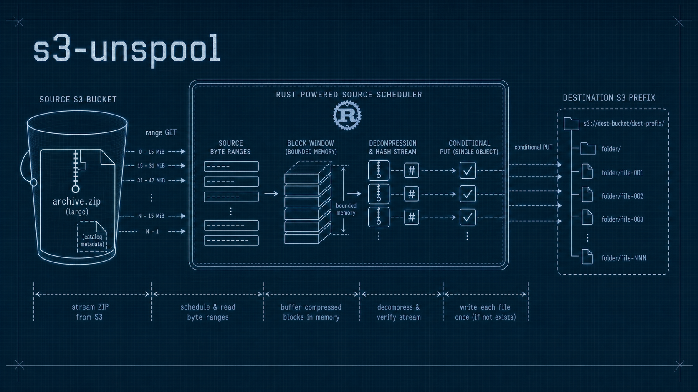

# s3-unspool

[](https://openai.com/codex)
[](https://crates.io/crates/s3-unspool)

<picture>
  <source media="(prefers-color-scheme: dark)" srcset="docs/assets/s3-unspool-hero-v2.png">
  <source media="(prefers-color-scheme: light)" srcset="docs/assets/s3-unspool-hero-v2-light.png">
  
</picture>

`s3-unspool` is a Rust crate and CLI for bounded-memory ZIP extraction from S3
into S3, with local ZIP helpers for development and testing.

It is built for deployment-style archives, Lambda jobs, and other environments
where downloading a whole ZIP to local disk is slow or impractical. The
extractor reads source bytes with ranged S3 `GetObject` requests, lists the
destination prefix once, skips unchanged files when the ZIP contains an embedded
catalog, and writes missing or changed files with conditional `PutObject`
requests.

## What It Does

| Capability | What happens |
| --- | --- |
| Full extract | Stream a ZIP from local disk or S3 into a local directory or S3 prefix. |
| Incremental extract | Skip unchanged files before decompression when the ZIP contains the embedded catalog. |
| Selective extract | Restore only entries matching include/exclude globs. |
| Safe overwrite | Use `If-None-Match` for new keys and `If-Match` for changed keys. |
| Zip helpers | Stream a local directory or existing S3 prefix into a cataloged local or S3 ZIP. |
| Large archive support | Plan source byte ranges and keep only a bounded source block window in memory. |

Use `s3-unspool` when you need to deploy, synchronize, or partially restore many
files from ZIP archives stored in S3, especially when repeated runs should touch
only changed files.

It is not a general archive library. ZIP extraction currently supports Stored,
Deflate, and Zstandard method 93 entries when default features are enabled;
destination writes are single `PutObject` requests, and destination ETags are
expected to be single-part MD5 ETags.

## Storage Economics

`s3-unspool` is useful when the archive is also the storage format, not just a
transport format. Compressible corpora such as Markdown, source code, JSON,
logs, generated reports, and documentation snapshots can be stored as sharded
ZIPs in S3 Standard, then restored by glob only when needed.

The economic case comes from two separate effects:

- compression reduces stored bytes and selected read bytes for any
  highly-compressible corpus
- aggregation avoids the 128 KiB minimum billable object size that applies to
  S3 Standard-IA, S3 One Zone-IA, and S3 Glacier Instant Retrieval objects

For example, the [economics model](docs/explanation/economics.md) estimates a
100 GiB logical corpus with 1% monthly access, stored uncompressed as individual
files versus 4:1 compressed ZIPs in S3 Standard:

| Workload | ZIPs in Standard | Individual Standard | Standard-IA | Glacier Instant |
| --- | ---: | ---: | ---: | ---: |
| 8 KiB text files | `$0.63/mo` | `$2.35/mo` | `$20.14/mo` | `$7.74/mo` |
| 4 MiB text files | `$0.58/mo` | `$2.30/mo` | `$1.26/mo` | `$0.43/mo` |

That is not a universal win. Individual objects are usually better when callers
need direct per-file `GetObject` access, per-file metadata, lifecycle policies,
event notifications, CDN URLs, or frequent single-file updates. Glacier Instant
Retrieval can also be cheaper for larger files with very cold access. The fit is
strongest when content is mostly immutable, compresses well, and is restored by
project, date, tenant, package, prefix, or glob.

The cost examples use us-east-1 public pricing checked on 2026-05-03. Refresh
pricing before making production storage decisions.

## Install

Add the library crate:

```sh
cargo add s3-unspool
```

For the Rust example below, also add the AWS SDK client crates and Tokio:

```sh
cargo add aws-config aws-sdk-s3
cargo add tokio --features macros,rt-multi-thread
```

Install the CLI with `cargo-binstall` when GitHub Release artifacts are
available:

```sh
cargo binstall s3-unspool-cli
```

The CLI crate is named `s3-unspool-cli`, but the installed command is
`s3-unspool`. To pin the first stable release explicitly, use
`cargo binstall s3-unspool-cli@0.1.0`.

## Minimal Rust Example

```rust
use aws_config::BehaviorVersion;
use aws_sdk_s3::Client;
use s3_unspool::{S3Object, S3Prefix, SyncOptions, sync_zip_to_s3};

#[tokio::main]
async fn main() -> s3_unspool::Result<()> {
    let config = aws_config::load_defaults(BehaviorVersion::latest()).await;
    let client = Client::new(&config);

    let extract = SyncOptions::new(
        S3Object::parse("s3://my-bucket/releases/site.zip")?,
        S3Prefix::parse("s3://my-bucket/www/")?,
    );

    let report = sync_zip_to_s3(&client, extract).await?;
    println!("changed files: {}", report.summary.uploaded_changed);

    Ok(())
}
```

See the [library reference](docs/reference/library.md) for more API examples,
including cataloged ZIP creation and selective extraction.

## Documentation

The docs are organized by reader intent:

| Section | Use it for |
| --- | --- |
| [Tutorials](docs/tutorials/README.md) | Learn the workflow with a small local round trip. |
| [How-to guides](docs/how-to/README.md) | Solve concrete tasks such as installing the CLI, creating cataloged ZIPs, selective extraction, and running benchmarks. |
| [Reference](docs/reference/README.md) | Look up CLI syntax, library APIs, permissions, reports, diagnostics, assumptions, and benchmark snapshots. |
| [Explanation](docs/explanation/README.md) | Understand the architecture, incremental extraction model, Lambda performance, and storage economics. |

Start at [docs/README.md](docs/README.md) for the full documentation map.

## Repository Layout

| Path | Purpose |
| --- | --- |
| `crates/s3-unspool` | Published Rust library crate |
| `crates/s3-unspool-cli` | Published CLI crate; installs `s3-unspool` |
| `tools/lambda-benchmark` | SAM/Cargo Lambda benchmark harness and runner |
| `tools/fixturegen` | Local fixture generation package |
| `docs/` | Tutorials, how-to guides, reference, explanation, and generated chart assets |

The Lambda package is repository tooling. The published packages are
`s3-unspool` for the library and `s3-unspool-cli` for the command-line binary.

## License

Licensed under the MIT license. See [LICENSE](LICENSE).
