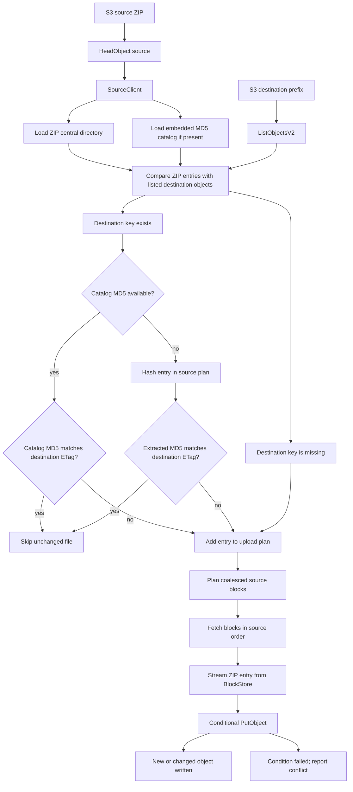

# Architecture

`s3-unspool` extracts ZIP archives from S3 to S3 without downloading the archive
to local storage. Source bytes are read with ranged `GetObject` requests,
destination state is read with one `ListObjectsV2` pass, and destination writes
use conditional `PutObject` requests.

## Extract Flow



The important properties are:

- The source ZIP is never materialized on disk.
- The destination prefix is listed once; listed ETags drive comparisons and
  conditional overwrites.
- Unchanged files can be skipped before source entry extraction when the ZIP has
  an embedded catalog.
- Missing files use `If-None-Match: *`.
- Changed files use `If-Match: <listed destination ETag>`.
- Destination `HeadObject` is not used, but conditional overwrites require
  `s3:GetObject` permission because S3 authorizes `If-Match` writes against
  object-read permission.
- Conditional write conflicts are skipped by default. Library users can set
  `SyncOptions::fail_on_conditional_conflict` to return an error on the first
  observed conflict.

## Embedded Catalog

ZIPs produced by `s3-unspool upload` include:

```text
.s3-unspool/catalog.v1.json
```

The catalog stores each file path and MD5 digest. During extraction, a catalog
entry can be compared directly with a destination ETag from `ListObjectsV2`.
When they match, the file is counted as unchanged and the extractor does not
decompress that entry.

External ZIP files still work. If the catalog is missing or ignored, existing
destination files with comparable single-part ETags are handled in a hash phase.
The hash phase reads only those entries, computes MD5, and adds changed entries
to a later upload phase.

## Source Scheduler

`SourceClient` is the shared ranged-read service used by the ZIP parser,
manifest loader, and planned block scheduler. It owns the source bucket/key,
source object length, source ETag observed at the start of extraction, and
optional source diagnostics.

When an observed source ETag is available, every ranged read is pinned to that
ETag. If the source object changes during extraction in that case, the run fails
or reports object errors instead of mixing bytes from different source versions.
If no source ETag is available, ranged reads cannot apply `If-Match`, so that
protection is not guaranteed for that extraction run.

Each source-consuming phase builds a `SourcePlan` from only the entries that
need source bytes in that phase. The planner sorts source spans, coalesces gaps
up to 256 KiB when the merged block stays under 8 MiB, and splits larger spans
into 8 MiB blocks.

`BlockStore` is the broker-owned block arena. Each source-consuming task gets
planned block claims before readers are admitted. The scheduler is the only code
path that can fetch planned source blocks; entry readers do not have a
cache-miss `GetObject` fallback. Readers wait for their claimed blocks, consume
bytes from resident blocks, and release each claim as they pass the block.

A ready block is released from memory only after both counters reach zero:

```text
live_claims == 0 && remaining_claims == 0
```

That makes future source demand explicit. A block can transition from
`Released` back to `Fetching` only for an explicit replay, such as a destination
PUT retry after the original streaming request body was consumed. Normal
no-error dense extraction should therefore fetch each planned block once.

Destination writes use single-part `PutObject`. Application-level retries
restart the destination request body from byte zero. A retry registers an
explicit replay claim, so any repeated source read appears as a replay/refetch
diagnostic rather than as hidden cache behavior. `SlowDown` and equivalent
throttling failures update a shared PUT cooldown so concurrent writers back off
together instead of retrying independently.

## Lambda Defaults

The library defaults are conservative and tunable through `SyncOptions`.

The Lambda binary uses adaptive settings because Lambda memory also controls
available CPU. The current policy is:

| Lambda memory | Entry workers | Source block | Source GETs | PUTs |
| ---: | ---: | ---: | ---: | ---: |
| 128 MB | 4 | 8 MiB | 1 | 2 |
| 256 MB | 6 | 8 MiB | 1 | 2 |
| 512 MB | 8 | 8 MiB | 2 | 2 |
| 1024 MB | 11 | 8 MiB | 4 | 4 |
| 2048 MB | 16 | 8 MiB | 8 | 8 |

The default worker count grows with the square root of memory:

```text
workers = clamp(round(4 * sqrt(lambda_memory_mb / 128)), 4, 16)
puts = min(workers, max(source_get_concurrency, 2), 8)
```

Before extraction, the Lambda inspects the ZIP central directory to count file
entries. The source block window then uses otherwise idle memory after reserving
fixed runtime overhead, worker overhead, per-file metadata overhead, and
in-flight source blocks:

```text
window = max(0, M - 64 MiB - 12 MiB * workers - 2 KiB * zip_files - in_flight)
in_flight = source_get_concurrency * source_block_size
if window > 512 MiB, window = window - 384 MiB
window = min(window, 512 MiB)
```

The window is capped by the source ZIP size. If the computed window is smaller
than one source block, the scheduler still allows one block in flight so the run
can make progress with minimal memory. Large window budgets reserve an extra
384 MiB of RSS slack for allocator behavior, ZIP/catalog metadata, SDK HTTP
buffers, and destination PUT streams during long uploads. This is intentionally
larger than the live Rust block window: Lambda enforces RSS, and a 128 MiB slack
was not enough for the 2048 MB large-archive run. The final 512 MiB cap is also
intentional: larger source windows produced OOMs before improving completion
time for the current large benchmark fixture.

The Lambda asks glibc to return freed pages at invocation boundaries. This is
intentional: warm execution environments can otherwise retain ZIP catalog/block
pages in RSS after Rust values are dropped, and Lambda memory limits are
enforced against RSS rather than live Rust object graphs.

The Lambda creates separate source and destination S3 clients inside each
invocation. The extra setup cost is small next to large extractions, and
separate clients keep ranged `GetObject` and streaming `PutObject` traffic on
independent HTTP pools. The destination client disables AWS SDK upload
stalled-stream protection while leaving download protection enabled. That is
intentional: a streaming PUT body can legitimately pause while it waits for the
source scheduler to fetch the next planned ZIP block, and `s3-unspool` already
tracks source GET failures and destination PUT retries explicitly.

## Diagnostics Glossary

Source and PUT diagnostics are collected only when `collect_diagnostics`,
`--diagnostics`, or Lambda payload `"diagnostics": true` is enabled.

| Field | Meaning |
| --- | --- |
| `source_get_attempts` | Ranged S3 `GetObject` attempts, including retries. |
| `planned_entries` | ZIP entries included in source plans. Catalog-skipped entries are excluded. |
| `planned_blocks` | Coalesced source blocks scheduled for hash or upload phases. |
| `fetched_blocks` | Planned source blocks fetched successfully. |
| `block_hits` | Reader requests served from ready planned blocks. |
| `block_waits` | Reader requests that waited for a scheduled block. |
| `block_releases` | Ready source blocks released after all planned claims consumed them. |
| `block_misses` | Reader cache misses; this should remain zero because readers cannot fetch. |
| `block_refetches` | Explicit replay fetches for blocks that had already been released. |
| `source_amplification` | Fetched source bytes divided by unique fetched source bytes. Higher values mean retry or metadata-read overlap. |
| `active_gets_high_water` | Highest number of concurrent ranged S3 GET requests observed. |
| `put.failed_attempts` | Failed destination `PutObject` attempts, including retryable attempts that later succeeded. |
| `put.failures_by_error_code` | Failed destination `PutObject` attempts grouped by AWS error code, or by SDK failure kind when no AWS service code exists. |
| `put.retry_attempts` | Application-level destination PUT retries scheduled after failed attempts. |
| `put.throttled_attempts` | Failed destination PUT attempts classified as throttling. |
| `put.throttle_waits` | Waits on the shared destination PUT cooldown. |

The benchmark tables report medians across successful samples. Their source
columns are fetch and scheduler counts, not file counts or upload times.

## Upload Flow

The upload helper is separate from extraction. It walks a local directory,
streams a ZIP archive to S3, and includes the embedded catalog by default.
Unlike extraction writes, source ZIP upload can use multipart upload because the
source ZIP ETag is not used as a destination file comparison digest.
