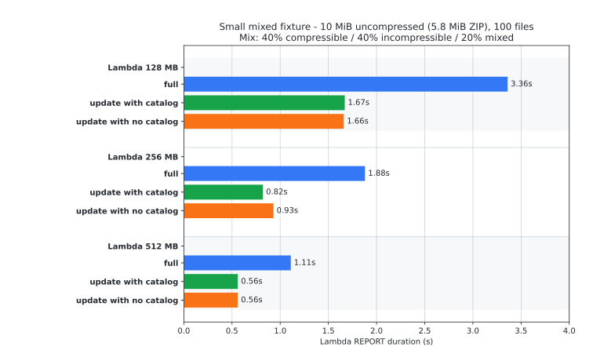

# Benchmark Snapshots

This document records reproducible benchmark snapshots for `s3-unspool` running
inside the repository Lambda harness. It is intended for readers who want to
understand observed behavior and reproduce the same benchmark shape, not as a
guarantee for every archive or AWS account.

Timings are Lambda CloudWatch `REPORT` duration medians from three samples per
configuration. Cold-start init time and local AWS CLI round-trip time are not
included.

The tables compare:

- a full extract into an empty destination
- a 5% update using the embedded catalog
- a 5% update while ignoring the embedded catalog, which forces the fallback
  extract-and-hash comparison path

## Large Streaming Fixture

This benchmark uses a 1,000-file fixture with a 40% compressible, 40%
incompressible, and 20% mixed-content split. The archive is 4,506 MiB when
extracted and 2,071 MiB as a ZIP, so every memory size below extracts a source
archive much larger than available Lambda memory.

<picture>
  <source media="(prefers-color-scheme: dark)" srcset="assets/benchmarks/streaming-20260430T011727Z/duration-streaming-dark.svg">
  <source media="(prefers-color-scheme: light)" srcset="assets/benchmarks/streaming-20260430T011727Z/duration-streaming-light.svg">
  
</picture>

| Lambda memory | Full extract | 5% update with catalog | 5% update without catalog | Median max memory |
| ---: | ---: | ---: | ---: | ---: |
| Lambda 128 MB | 340.31s | 14.09s | 260.73s | 92-103 MB |
| Lambda 256 MB | 153.54s | 7.71s | 121.60s | 115-202 MB |
| Lambda 512 MB | 78.99s | 4.03s | 58.57s | 200-511 MB |

All 27 measured invokes completed with zero reported extraction errors, zero S3
throttles, and zero source `GetObject` errors. Four destination `PutObject`
dispatch failures occurred in the Lambda 256 MB full-extract samples and were
retried successfully.

## Small Mixed Fixture

This benchmark uses a 100-file mixed fixture generated at 10 MiB uncompressed.
The generator used the same class split as the large benchmark: 40%
compressible, 40% incompressible, and 20% mixed content. The base and mutated
fixtures were uploaded as cataloged Deflate ZIPs of about 5.8 MiB each. The
update fixture changed 5 files, totaling 191,590 rewritten bytes.

Run id: `small100-20260503T073310Z`

<picture>
  <source media="(prefers-color-scheme: dark)" srcset="assets/benchmarks/small100-20260503T073310Z/duration-small100-dark.svg">
  <source media="(prefers-color-scheme: light)" srcset="assets/benchmarks/small100-20260503T073310Z/duration-small100-light.svg">
  
</picture>

| Lambda memory | Full extract | 5% update with catalog | 5% update without catalog | Median max memory |
| ---: | ---: | ---: | ---: | ---: |
| Lambda 128 MB | 3.36s | 1.67s | 1.66s | 65-71 MB |
| Lambda 256 MB | 1.88s | 0.82s | 0.93s | 58-68 MB |
| Lambda 512 MB | 1.11s | 0.56s | 0.56s | 63-70 MB |

All 27 measured invokes completed with zero reported extraction errors, zero
conditional conflicts, zero destination `PutObject` failures, zero retries, and
zero S3 throttles.

At this size, fixed Lambda invocation and S3 request overhead are a much larger
share of total time. The embedded catalog still helps at Lambda 256 MB, but by
Lambda 512 MB the 5% update with and without catalog are effectively tied in
this sample.

## Parameters

Both benchmark snapshots used the same Lambda run matrix:

- `--runs full,update-catalog,update-ignore`
- `--memories 128,256,512`
- `--samples 3`
- default serial benchmark execution with `--max-workers 1`
- diagnostics enabled and per-object operations omitted
- Lambda adaptive entry workers: 4 at Lambda 128 MB, 6 at Lambda 256 MB, and 8
  at Lambda 512 MB
- Lambda adaptive source `GetObject` concurrency: 1 at Lambda 128/256 MB and 2
  at Lambda 512 MB

The small fixture was generated with:

```sh
uv run --project tools/fixturegen s3-unspool-generate-fixture ./base \
  --files 100 \
  --total-size 10MiB \
  --seed 42 \
  --clean

uv run --project tools/fixturegen s3-unspool-mutate-fixture ./base ./mutated-5pct \
  --change-ratio 0.05 \
  --seed 2 \
  --clean
```

## Reproduce

The Lambda benchmark harness and fixture tooling live under `tools/`:

- [`tools/lambda-benchmark`](../tools/lambda-benchmark/README.md): SAM/Cargo
  Lambda benchmark app plus the `s3-unspool-benchmark` runner.
- [`tools/fixturegen`](../tools/fixturegen/README.md): deterministic fixture and
  update-fixture generator used by the benchmark harness.

See [Architecture](architecture.md) for the extraction flow, source scheduler,
block window behavior, and diagnostics terminology.
