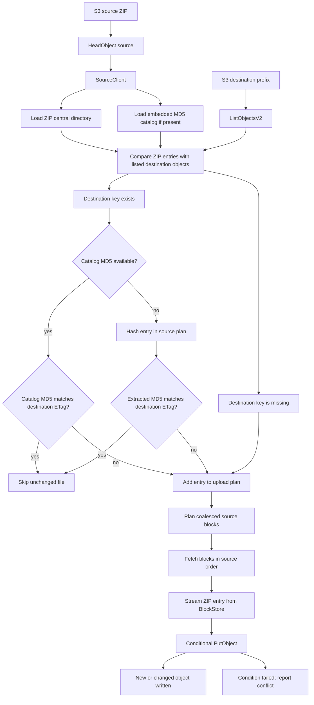

# Architecture

This page explains how `s3-unspool` extracts ZIP archives with bounded memory.
It focuses on the flow and design choices. For exact fields and options, use the
[reference](../reference/README.md).

`s3-unspool` extracts ZIP archives from S3 to S3 without downloading the archive
to local storage. It reads source bytes with ranged `GetObject` requests, reads
destination state with one `ListObjectsV2` pass, and writes destination objects
with conditional `PutObject` requests.

## Five-Step Mental Model

For a normal S3-to-S3 extract, the system does five things:

1. Read the ZIP central directory and, when present, the embedded catalog.
2. List the destination prefix once to learn existing keys and ETags.
3. Classify entries as missing, changed, unchanged, conflicted, or out of scope
   after include/exclude selection.
4. Plan only the source byte ranges needed by entries that require source data.
5. Stream those ranges through ZIP entry readers into conditional S3 writes.

The rest of the architecture exists to make those steps bounded, retryable, and
observable without materializing the source ZIP or all extracted files.

## Extract Flow



This flow has a few important properties:

- The source ZIP is never materialized on disk.
- The destination prefix is listed once; listed ETags drive comparisons and
  conditional overwrites.
- Unchanged files can be skipped before source entry extraction when the ZIP has
  an embedded catalog.
- Missing files use `If-None-Match: *`.
- Changed files use `If-Match: <listed destination ETag>`.
- Destination `HeadObject` is not used, but conditional overwrites require
  `s3:GetObject` permission because S3 authorizes `If-Match` writes against
  object-read permission.
- Conditional write conflicts are reported and skipped by default. Library users
  can set `SyncOptions::fail_on_conflict()` to return an error on the first
  observed conflict.

## Embedded Catalog

ZIPs produced by `s3-unspool` include:

```text
.s3-unspool/catalog.v1.json
```

The catalog stores each file path and MD5 digest. During extraction, a catalog
entry can be compared directly with a destination ETag from `ListObjectsV2`.
When they match, the file is counted as unchanged and the extractor does not
decompress that entry.

External ZIP files still work. If the catalog is missing or ignored, existing
destination files with comparable single-part ETags are handled in a hash phase.
The hash phase reads only those entries, computes MD5, and adds changed entries
to a later upload phase.

Selective extraction is layered on top of the same manifest and source-planning
model. Include and exclude patterns filter ZIP entries before source blocks are
planned, so selected restores still benefit from ranged reads and block
coalescing.

## Source Scheduler

`SourceClient` is the shared ranged-read service used by the ZIP parser,
manifest loader, and planned block scheduler. It owns the source bucket/key,
source object length, source ETag observed at the start of extraction, and
optional source diagnostics.

When the source ETag was observed at the start of extraction, every ranged read
is pinned to that ETag. If the source object changes mid-run, extraction fails
or reports object errors rather than mixing bytes from different source
versions. If no source ETag is available, ranged reads cannot apply `If-Match`,
and that protection does not apply to the run.

Each source-consuming phase builds a `SourcePlan` from only the entries that
need source bytes in that phase. The planner sorts source spans, coalesces gaps
up to 256 KiB when the merged block stays under 8 MiB, and splits larger spans
into 8 MiB blocks.

`BlockStore` is the scheduler-owned block arena. Each source-consuming task gets
planned block claims before readers are admitted. The scheduler is the only code
path that can fetch planned source blocks; entry readers do not have a
cache-miss `GetObject` fallback. Readers wait for their claimed blocks, consume
bytes from resident blocks, and release each claim as they pass the block.

A ready block is released from memory only after both counters reach zero:

```text
live_claims == 0 && remaining_claims == 0
```

That keeps future source demand visible. A block can transition from `Released`
back to `Fetching` only for an explicit replay, such as a destination PUT retry
after the original streaming request body was consumed. Normal no-error dense
extraction should therefore fetch each planned block once.

Destination writes use single-part `PutObject`. Application-level retries
restart the destination request body from byte zero. A retry registers an
explicit replay claim, so any repeated source read appears as a replay/refetch
diagnostic rather than as hidden cache behavior. `SlowDown` and equivalent
throttling failures update a shared PUT cooldown so concurrent writers back off
together instead of retrying independently.

## Upload Flow

The upload helper is separate from extraction. It walks a local directory,
streams a ZIP archive to S3, and includes the embedded catalog by default.
Unlike extraction writes, source ZIP upload can use multipart upload because the
source ZIP ETag is not used as a destination file comparison digest.

S3-prefix upload follows the same archive format. It lists source objects,
streams them into a generated ZIP, preserves zero-byte trailing-slash directory
markers as ZIP directory entries, and rejects nonzero S3 objects whose keys end
in `/` as ambiguous.

## See Also

- [Incremental Extraction](incremental-extraction.md)
- [Performance and Lambda](performance-and-lambda.md)
- [Diagnostics](../reference/diagnostics.md)
- [S3 Permissions](../reference/permissions.md)
