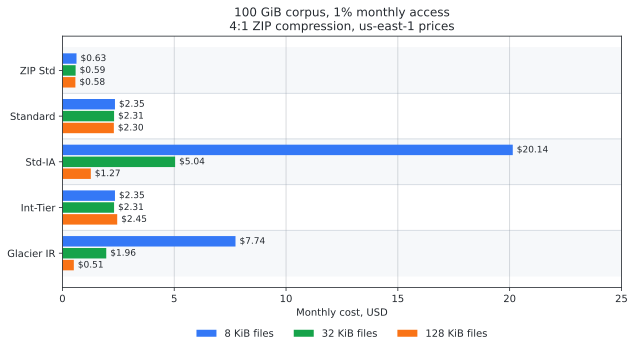
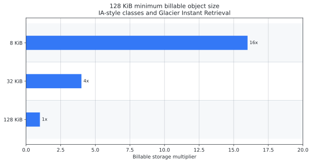
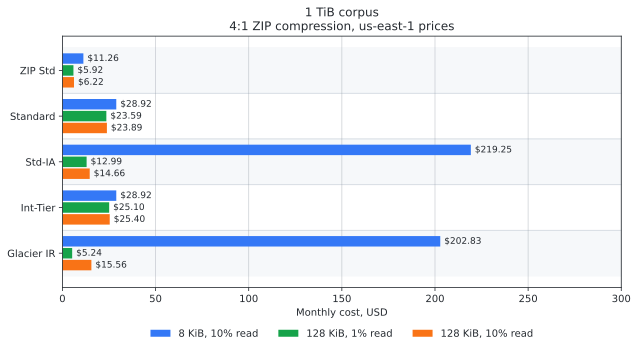
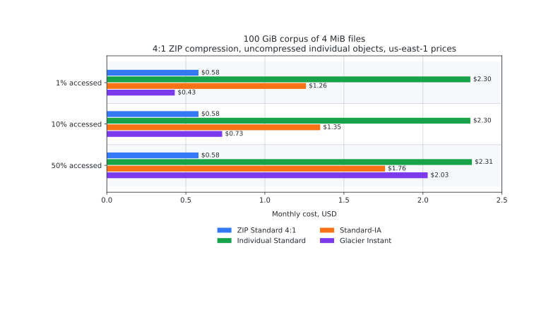

# Economics

This document covers a common use case for `s3-unspool`: storing a compressible
corpus as one or more ZIP objects in S3, then extracting only matching entries
on demand with include and exclude globs.

Use it when deciding whether compressed archive storage fits a real S3
workload. The numbers are scenario models, not a pricing guarantee.

Small files are the most obvious fit because S3 small-object minimums can
dominate the bill. They are not the only fit. Megabyte-scale Markdown exports,
JSONL datasets, logs, code bundles, generated reports, or other highly
compressible files can still benefit from compressed storage and selective
entry-level extraction, especially when access is grouped by project, date,
tenant, package, or snapshot.

The case is strongest when the corpus is mostly read-only, compresses well, and
is usually accessed by prefix, glob, project, date, or other grouped selection.
It weakens when callers need low-latency direct `GetObject` access to each file,
independent per-file metadata, per-file lifecycle rules, event notifications, or
frequent single-file updates.

Use this page to reason about the storage model. Use
[Benchmark Snapshots](../reference/benchmark-snapshots.md) to inspect measured
Lambda extraction behavior, and use the [Architecture](architecture.md) page to
understand how selection maps to ranged reads.

## Quick Decision Guide

This model is a good candidate when most of these are true:

- the corpus is mostly Markdown, code, JSON, logs, reports, or other
  compressible content
- files are either very small, or larger but still compress well
- access is sporadic and grouped by project, date, tenant, package, prefix, or
  glob
- updates can be represented as new archive snapshots or delta archives
- callers do not need normal S3 semantics for every individual file

It is usually a poor fit when callers need low-latency direct access to
arbitrary individual files, frequent single-file updates, per-file metadata or
lifecycle rules, browser/CDN URLs for every object, or true archival storage
where restore delay is acceptable.

## Why ZIP Aggregation Can Help

There are two separate benefits, and they apply to different workloads:

- Small-object aggregation avoids per-object minimums and monitoring overhead
  that can make lower-cost S3 classes surprisingly expensive for tiny files.
- Compression reduces stored bytes and selected read bytes for any highly
  compressible corpus, including megabyte-scale files. `s3-unspool` applies
  selection before source range planning, so it can fetch only the compressed
  ZIP ranges needed for matching entries instead of downloading the whole
  archive.

For the first mechanism, S3 storage classes are priced per stored byte, but
several lower-cost classes also have per-object behavior that matters for small
files:

- S3 Standard-IA and S3 One Zone-IA have a 128 KiB minimum billable object size
  and a 30-day minimum storage duration.
- S3 Glacier Instant Retrieval has a 128 KiB minimum billable object size and a
  90-day minimum storage duration.
- S3 Intelligent-Tiering can store objects smaller than 128 KiB, but those
  objects are not eligible for auto-tiering. They remain in the Frequent Access
  tier and do not pay monitoring charges.

That means a corpus of 8 KiB Markdown files can be charged as 16 times larger
than its logical size in Standard-IA or Glacier Instant Retrieval. A corpus of
32 KiB files can be charged as 4 times larger. Compression and aggregation avoid
that small-object multiplier.

With ZIP aggregation, the storage cost in S3 Standard is roughly:

```text
logical_size_gb / compression_ratio * 0.023 USD per GB-month
```

At 4:1 compression, S3 Standard costs about `0.00575 USD` per logical GB-month,
before requests. That is less than uncompressed S3 Standard, close to Glacier
Instant Retrieval storage pricing, and does not carry IA/Glacier retrieval fees.

For larger files, the small-object multiplier disappears, but compression can
still change the comparison. A 100 GiB logical corpus compressed 4:1 costs about
`0.58 USD/month` in S3 Standard storage before requests. Whether that beats
Standard-IA or Glacier Instant Retrieval depends mostly on access frequency and
retrieval fees.

## Pricing Snapshot

The simulations below use us-east-1 public prices checked on 2026-05-03. Prices
change, so treat the numbers as an example and refresh them before making a
production cost commitment.

| Item | Price used |
| --- | ---: |
| S3 Standard storage | `$0.023/GB-month` |
| S3 Standard GET | `$0.0004/1,000 requests` |
| S3 Standard PUT/LIST | `$0.005/1,000 requests` |
| S3 Standard-IA storage | `$0.0125/GB-month` |
| S3 Standard-IA GET | `$0.001/1,000 requests` |
| S3 Standard-IA retrieval | `$0.01/GB` |
| S3 Glacier Instant Retrieval storage | `$0.004/GB-month` |
| S3 Glacier Instant Retrieval GET | `$0.01/1,000 requests` |
| S3 Glacier Instant Retrieval retrieval | `$0.03/GB` |
| S3 Intelligent-Tiering monitoring | `$0.0025/1,000 monitored objects-month` |
| Lambda request | `$0.20/1,000,000 requests` |
| Lambda compute | `$0.0000166667/GB-second` |

The model ignores data transfer out to the internet. It assumes a selected
extract reads only the compressed bytes for matching entries plus ZIP metadata.
If extraction writes many files back to S3, add destination `PutObject` costs.

Sources:

- [Amazon S3 pricing](https://aws.amazon.com/s3/pricing/)
- [Amazon S3 storage class documentation](https://docs.aws.amazon.com/AmazonS3/latest/userguide/storage-class-intro.html)
- [Amazon S3 FAQ for Intelligent-Tiering behavior](https://aws.amazon.com/s3/faqs/)
- [AWS Lambda pricing](https://aws.amazon.com/lambda/pricing/)
- [AWS public price list for Amazon S3 in us-east-1](https://pricing.us-east-1.amazonaws.com/offers/v1.0/aws/AmazonS3/current/us-east-1/index.json)

## Scenario: Many Small Text Files

The first table compares monthly cost for a 100 GiB logical corpus when 1% of
the corpus is read each month. ZIP storage is S3 Standard. Individual-file
storage is uncompressed.

| Average file size | ZIP Standard 4:1 | Individual Standard | Standard-IA | Intelligent-Tiering | Glacier Instant |
| ---: | ---: | ---: | ---: | ---: | ---: |
| 8 KiB | `$0.63` | `$2.35` | `$20.14` | `$2.35` | `$7.74` |
| 32 KiB | `$0.59` | `$2.31` | `$5.04` | `$2.31` | `$1.96` |
| 128 KiB | `$0.58` | `$2.30` | `$1.27` | `$2.45` | `$0.51` |

<picture>
  <source media="(prefers-color-scheme: dark)" srcset="../assets/storage-economics/storage-economics-100gib-dark.svg">
  <source media="(prefers-color-scheme: light)" srcset="../assets/storage-economics/storage-economics-100gib-light.svg">
  
</picture>

For 8 KiB and 32 KiB files, ZIP-in-Standard is the cheapest option in this
model. For 128 KiB files with very low access, Glacier Instant Retrieval can be
cheaper because the small-object minimum no longer inflates the billable size.
That advantage narrows or disappears as compression improves or access rises.

## Small-Object Minimums Dominate

For a 100 GiB logical corpus, the billable storage multiplier is:

| Average file size | Approximate object count | IA/Glacier billable size |
| ---: | ---: | ---: |
| 8 KiB | 13.1M objects | 1.6 TiB |
| 32 KiB | 3.28M objects | 400 GiB |
| 128 KiB | 819K objects | 100 GiB |

<picture>
  <source media="(prefers-color-scheme: dark)" srcset="../assets/storage-economics/storage-economics-small-object-multiplier-dark.svg">
  <source media="(prefers-color-scheme: light)" srcset="../assets/storage-economics/storage-economics-small-object-multiplier-light.svg">
  
</picture>

This is why Standard-IA and Glacier Instant Retrieval can be more expensive than
S3 Standard for many tiny text files. The nominal per-GB storage price is lower,
but the billable size can be much larger than the logical corpus.

Intelligent-Tiering behaves differently: files below 128 KiB stay in the
Frequent Access tier. At 128 KiB, files can tier down, but the monitoring charge
becomes visible because there are so many objects. For 100 GiB at 128 KiB
average, there are about 819,200 objects, so monitoring alone is about:

```text
819,200 / 1,000 * 0.0025 = 2.05 USD per month
```

That is before storage.

## Scaling to 1 TiB

For a 1 TiB corpus, multiply the 100 GiB examples by about 10.24, assuming the
same object-size and access patterns.

| Scenario | ZIP Standard 4:1 | Individual Standard | Standard-IA | Intelligent-Tiering | Glacier Instant |
| --- | ---: | ---: | ---: | ---: | ---: |
| 8 KiB files, 10% accessed | `$11.26` | `$28.92` | `$219.25` | `$28.92` | `$202.83` |
| 128 KiB files, 1% accessed | `$5.92` | `$23.59` | `$12.99` | `$25.10` | `$5.24` |
| 128 KiB files, 10% accessed | `$6.22` | `$23.89` | `$14.66` | `$25.40` | `$15.56` |

<picture>
  <source media="(prefers-color-scheme: dark)" srcset="../assets/storage-economics/storage-economics-1tib-dark.svg">
  <source media="(prefers-color-scheme: light)" srcset="../assets/storage-economics/storage-economics-1tib-light.svg">
  
</picture>

The 1 TiB examples show the same pattern at production scale. ZIP aggregation
wins strongly for tiny files. Glacier Instant Retrieval can be the pure
storage-cost winner for 128 KiB files at very low access, but it becomes less
attractive as reads increase because GET and retrieval fees are higher.

## Scenario: Megabyte-Scale Compressible Files

For larger files, the small-object minimum is no longer the main issue. The
question becomes whether compressed S3 Standard plus selected ZIP entry reads is
better than storing uncompressed individual objects in Standard, Standard-IA, or
Glacier Instant Retrieval.

The table below models a 100 GiB logical corpus of 4 MiB files, about 25,600
objects if stored individually. The ZIP case assumes 4:1 compression and S3
Standard storage. Individual-object storage is uncompressed.

| Monthly access | ZIP Standard 4:1 | Individual Standard | Standard-IA | Glacier Instant |
| ---: | ---: | ---: | ---: | ---: |
| 1% | `$0.58` | `$2.30` | `$1.26` | `$0.43` |
| 10% | `$0.58` | `$2.30` | `$1.35` | `$0.73` |
| 50% | `$0.58` | `$2.31` | `$1.76` | `$2.03` |

<picture>
  <source media="(prefers-color-scheme: dark)" srcset="../assets/storage-economics/storage-economics-megabyte-files-dark.svg">
  <source media="(prefers-color-scheme: light)" srcset="../assets/storage-economics/storage-economics-megabyte-files-light.svg">
  
</picture>

The cost curve looks different from the tiny-file case. At 1% monthly access,
Glacier Instant Retrieval is cheaper in this model because there is no
small-object penalty and retrieval volume is low. As access rises, retrieval
fees matter more, and compressed ZIPs in S3 Standard become more attractive.

The operational argument can also matter. A sharded ZIP snapshot gives one
versioned object per shard, compressed storage, and glob-based partial restore.
That can be a better shape for "restore this project/date/tenant subset" than
listing and fetching thousands of individual objects. But if callers usually
fetch exactly one whole file by key, individually compressed objects in S3
Standard can offer similar storage savings with simpler direct access.

## Access Cost and Lambda Cost

For local extraction or extraction to a compute worker, request costs are
usually small relative to storage. For 100 GiB of 8 KiB files, reading 1% of the
files means about 131,000 selected files:

| Storage class | GET cost for 131K reads |
| --- | ---: |
| S3 Standard | `$0.05` |
| S3 Standard-IA | `$0.13` |
| S3 Glacier Instant Retrieval | `$1.31` |

`s3-unspool` uses ranged `GetObject` requests against the ZIP source. If every
selected entry requires a separate range, request counts can resemble direct
file reads. If nearby ranges coalesce, the ZIP path is better. If the archive is
sharded poorly or the selected files are scattered across a huge ZIP, the ZIP
path can fetch more metadata and ranges than expected.

Lambda compute is rarely the dominant cost. At 512 MB, a conservative
50 MiB/s extraction rate is about `0.000167 USD` per logical GiB extracted
before free tier effects. The practical Lambda concerns are timeout, memory
window sizing, retry behavior, and whether a large extraction should be split
across multiple invocations or run on ECS, Batch, or a local worker.

Writing extracted files back to S3 can change the cost picture. For a 100 GiB
corpus with 8 KiB files, materializing 10% of the corpus writes about 1.31M
objects. In S3 Standard, that is about `6.55 USD` in output PUT requests before
storage. That cost does not apply when extracting to local disk; competing
workflows that materialize derived output incur similar PUT costs.

## When This Is a Good Fit

Use ZIP aggregation when most of these are true:

- Files are compressible text, structured data, source artifacts, logs, reports,
  or bundles.
- Files fall into one of two regimes: small enough that object-count effects
  matter, or large and highly compressible.
- Compression is at least 2:1, and preferably 4:1 or better.
- Access is sporadic and naturally grouped by glob, prefix, package, project, or
  snapshot.
- The corpus is mostly immutable, or updates can be represented as new archive
  snapshots or delta archives.
- You do not need S3 to manage per-file lifecycle, object tags, event
  notifications, object-level IAM boundaries, or direct per-file URLs.

For this shape, `s3-unspool` provides the missing operation: fetch only the
compressed ZIP ranges needed for selected entries and extract them without
materializing the full archive.

## When Individual Objects Are Better

Store files individually when any of these are central to the workload:

- Low-latency direct access to arbitrary single files through normal S3
  `GetObject` APIs.
- Frequent independent file updates.
- Per-file metadata, tags, object lock, event notifications, lifecycle policies,
  or inventory semantics.
- CDN or browser delivery where each file must be addressable directly.
- True archival storage where restore delay is acceptable; in that case Glacier
  Flexible Retrieval or Deep Archive may beat any instant-access design, but
  they are not comparable to on-demand partial extraction.

Glacier Instant Retrieval can beat ZIP-in-Standard for 128 KiB-or-larger files
when access is very cold and compression is modest. With 100 GiB of 128 KiB
files, the rough monthly-access break-even points are:

| ZIP compression | ZIP Standard becomes cheaper than Glacier Instant Retrieval above |
| ---: | ---: |
| 2:1 | about 7% of the corpus per month |
| 4:1 | about 1.6% of the corpus per month |
| 8:1 | cheaper at any access level in this model |

## Operational Guidance

Do not create one enormous ZIP unless the selection pattern is also coarse. For
large corpora, shard archives by a stable access boundary such as project, date,
repository, tenant, or prefix. Sharding improves update workflows, keeps central
directories manageable, reduces tail latency, and makes partial extraction less
likely to scan scattered members across unrelated content.

A good archive layout for documentation might look like:

```text
s3://example-docs-archive/snapshots/2026-05-03/repo-a.zip
s3://example-docs-archive/snapshots/2026-05-03/repo-b.zip
s3://example-docs-archive/snapshots/2026-05-03/site-content.zip
```

Then a caller can extract only what it needs:

```sh
s3-unspool unzip \
  s3://example-docs-archive/snapshots/2026-05-03/repo-a.zip \
  ./restore \
  --include 'docs/**/*.md' \
  --include 'crates/**/README.md' \
  --exclude 'docs/drafts/**'
```

For S3-to-S3 restores, the same selection should be scoped carefully. Avoid
combining `--delete-extra` with partial restores: the CLI rejects that
combination because unselected destination objects are outside the restore
scope.

## Conclusion

The strongest case for `s3-unspool` is not "ZIP is always cheaper than S3
storage classes." The narrower claim is:

For highly compressible corpora that are accessed sporadically by selection
patterns, storing sharded ZIPs in S3 Standard and extracting matching entries on
demand can be cheaper and operationally cleaner than storing uncompressed
individual S3 objects. The advantage is largest below 128 KiB average file size,
where IA-style storage classes and Intelligent-Tiering do not behave like simple
per-GB discounts. For megabyte-scale files, the case depends more on compression
ratio, access frequency, retrieval fees, and whether archive-level snapshots and
glob extraction match the workflow.

The case weakens when access is extremely cold, when per-file S3 semantics
matter, when individually compressed objects are a better direct-access shape,
or when the workflow repeatedly materializes large extracted subsets back into
S3.
